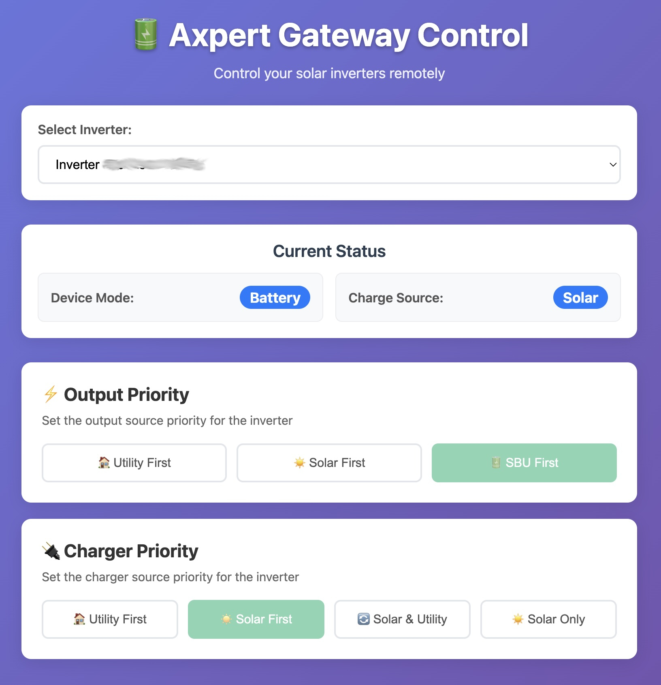
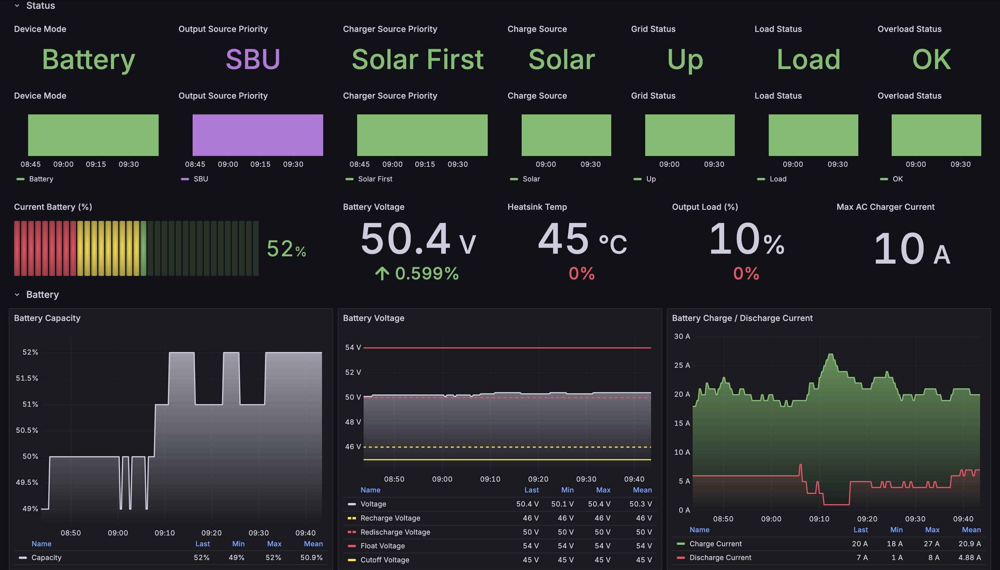

# Axpert Gateway

A Prometheus metrics gateway for Axpert solar inverters, providing real-time monitoring and data collection via USB connectivity.

## Quick Start

### Using Docker (Recommended)

Pull the latest image from GitHub Container Registry:

```bash
docker pull ghcr.io/marevers/axpert-gateway:latest
```

Run the container with USB device access:

```bash
docker run -d \
  --name axpert-gateway \
  --device=/dev/hidraw0 \
  -p 8080:8080 \
  ghcr.io/marevers/axpert-gateway:latest
```

### Building from Source

#### Prerequisites

- Go 1.24.6 or later
- Node.js 22 or later (for frontend development)
- libhidapi-dev and libudev-dev (for USB HID support)
- pkg-config

#### Installation

```bash
# Clone the repository
git clone https://github.com/marevers/axpert-gateway.git
cd axpert-gateway

# Install Go dependencies (Ubuntu/Debian)
sudo apt-get install pkg-config libhidapi-dev libudev-dev

# Build frontend (required for control interface)
cd frontend
npm install
npx tsc app.ts --target es2017 --lib es2017,dom --outDir .
cd ..

# Build the application
go build -o axpert-gateway .

# Run the application with control API enabled
./axpert-gateway --axpert.control=true
```

#### Cross-compile for Raspberry Pi (arm64)

To cross-compile for Raspberry Pi, you can build using the included build script (requires Docker):

```bash
./build.sh
```

#### Development

The project includes a TypeScript-based frontend located in the `frontend/` directory:

```bash
# Frontend development
cd frontend
npm install                    # Install dependencies
npx tsc app.ts --target es2017 --lib es2017,dom --outDir .  # Compile TypeScript
```

**Frontend Files:**
- `frontend/app.ts` - TypeScript source code
- `frontend/index.html` - Main HTML interface
- `frontend/styles.css` - CSS styling
- `frontend/package.json` - npm configuration

## Configuration

The application supports the following command-line flags:

| Flag | Default | Description |
|------|---------|-------------|
| `--log.level` | `info` | Log level for logging (debug, info, warn, error) |
| `--web.listen-address` | `:8080` | The address to listen on for HTTP requests |
| `--web.telemetry-path` | `/metrics` | Path under which to expose metrics |
| `--axpert.interval` | `30` | Interval in seconds for data polling |
| `--axpert.metrics` | `true` | Enable/disable metrics collection |
| `--axpert.control` | `false` | Enable/disable control API |

### Example Usage

```bash
# Run with custom settings
./axpert-gateway \
  -log.level=debug \
  -web.listen-address=:9090 \
  -axpert.interval=60 \
  -axpert.control=true
```

## API Endpoints

- **`/`** - Landing page with links to available endpoints
- **`/metrics`** - Prometheus metrics endpoint
- **`/healthz`** - Health check endpoint
- **`/control/`** - Web-based control interface (when control API is enabled)
- **`/api/inverters`** - List available inverters (JSON API)
- **`/api/command/:command`** - Execute inverter commands (JSON API)
- **`/api/settings`** - Get current inverter settings (JSON API)

## Control API & Web Interface

The gateway includes a control API and web interface for managing your Axpert inverters remotely.

### Web Control Interface

Access the web interface at: `http://localhost:8080/control/`



**Features:**
- **Real-time Settings Display** - View current inverter configuration and status
- **Multi-inverter Support** - Switch between multiple connected inverters
- **Output Priority Control** - Set output priority
- **Charger Priority Control** - Set charger priority

### Control API Endpoints

Enable the control API with the `--axpert.control=true` flag.

#### List Inverters
```bash
GET /api/inverters
```

**Response:**
```json
{
  "inverters": [
    {"serialno": "12456789000000"},
    {"serialno": "12456789000000"}
  ],
  "count": 2
}
```

#### Get Current Settings
```bash
POST /api/settings
Content-Type: application/json

{
  "serialno": "12456789000000"
}
```

**Response:**
```json
{
  "serialno": "12456789000000",
  "settings": {
    "outputSourcePriority": "solar",
    "chargerSourcePriority": "solarfirst",
    "deviceMode": "inverter",
    "chargeSource": "solar",
    "batteryRechargeVoltage": 48.0,
    "batteryRedischargeVoltage": 50.0,
    "batteryCutoffVoltage": 44.0,
    "batteryFloatVoltage": 54.0
  }
}
```

#### Execute Commands
```bash
POST /api/command/:command
Content-Type: application/json

{
  "value": "solar",
  "serialno": "12456789000000"
}
```

**Available Commands:**
- `setOutputPriority` - Values: `utility`, `solar`, `sbu`
- `setChargerPriority` - Values: `utilityfirst`, `solarfirst`, `solarandutility`, `solaronly`
- `setBatteryRechgVoltage` - Values: whole numbers between `44` and `51`
- `setBatteryRedischgVoltage` - Values: whole numbers between `48` and `58`

**Response:**
```json
{
  "command": "setOutputPriority",
  "value": "solar",
  "status": "success",
  "message": "Command executed successfully"
}
```

### 📋 Example Usage

```bash
# Enable control API and start gateway
./axpert-gateway --axpert.control=true

# Set output priority via API
curl -X POST http://localhost:8080/api/command/setOutputPriority \
  -H "Content-Type: application/json" \
  -d '{"value": "solar", "serialno": "12456789000000"}'

# Or use the web interface at http://localhost:8080/control/
```

## Metrics & Monitoring

The gateway exposes comprehensive Axpert inverter metrics in Prometheus format, including:

### Metrics
- **Power Data** - AC/DC input/output power, load percentages
- **Battery Status** - Voltage levels, charge state, temperature
- **Inverter Parameters** - Operating mode, priorities, efficiency
- **System Health** - Device status, warnings, error conditions

Metrics are collected with a `serialno` label (multiple connected inverters supported) and the collection interval is configurable (default: 30s).

Access metrics at: `http://localhost:8080/metrics`

## Hardware Requirements

- Axpert solar inverter with USB connectivity
- USB cable (typically USB-A to USB-B)
- Linux-based system (Raspberry Pi recommended)
- USB HID support in kernel

## Monitoring Setup

### Prometheus Configuration

Add the following to your `prometheus.yml`:

```yaml
scrape_configs:
  - job_name: 'axpert-gateway'
    static_configs:
      - targets: ['localhost:8080']
    scrape_interval: 30s
    metrics_path: /metrics
```

### Grafana Dashboard

An example of a Grafana dashboard can be found in `./dashboard/axpert-grafana.json`.



## Troubleshooting

### Common Issues

1. **USB Permission Denied**
   ```bash
   # Add user to dialout group
   sudo usermod -a -G dialout $USER
   # Or run with appropriate permissions
   sudo ./axpert-gateway
   ```

2. **No Inverters Found**
   - Check USB connection
   - Verify inverter is powered on
   - Ensure USB drivers are installed

3. **Metrics Not Updating**
   - Check inverter connectivity
   - Verify polling interval settings
   - Review application logs

4. **Settings Not Available (503 Error)**
   - Settings are cached during metrics collection cycles
   - Wait for next collection cycle (default: 30 seconds)
   - Ensure metrics collection is enabled (`--axpert.metrics=true`)

## License

This project is licensed under the Apache 2.0 License - see the [LICENSE](LICENSE.txt) file for details.
